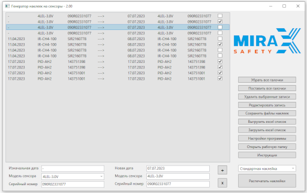
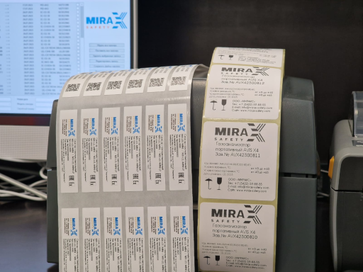

# Mirax.LabelGenerator.Public
This is a public description of an internal project I did for the Mirax-safety company. Label Generator uses data from an internal system to automatically generate and print labels.

 

## The following technologies were used to create it:
*	Base tech: .NET 7, LINQ, Git, Windows, MS Visual Studio
*	DB: LiteDB, Excel files
*	MS Office: EPPlus, Spire.Doc, Interop
*	UI frameworks: WPF with binding and ObservableCollections
*	Serializing: Newtonsoft.Json

## User instruction
Main work process:
* Enter data from an existing sensor label (date, model, serial number)
* Enter new data for the sticker
* Add an entry to the list with the "+" button
* After adding sensors, tick the records that you want to print
* Press the "Print stickers" button.
 
Additionally:
* "X" button clears input fields
* If you want to change an entry, double-click on it, it will open in the input fields where you can edit it. Then you need to press "X". You can also use the "Edit Post" button on the right.
* When entering data, a new entry can be added by pressing the Enter button.

Functions of the buttons on the panel on the right:
* Remove checkboxes - all checkboxes in the list will be removed
* Check all checkboxes - all entries in the list will be marked
* Delete selected entries - marked entries will be deleted
* Edit post - the post will be editable in the fields below
* Save sticker files - checkboxed entries will be saved to Word files ready for printing
* Upload excel list - the entire list will be saved to an Excel file
* Load excel list - entries will be loaded from an excel file
* Program settings - provide access to the program configuration, after changing the program you need to restart
* Instruction - opens a window with this file
* Print stickers - tagged records will be sent to the printer.

  
